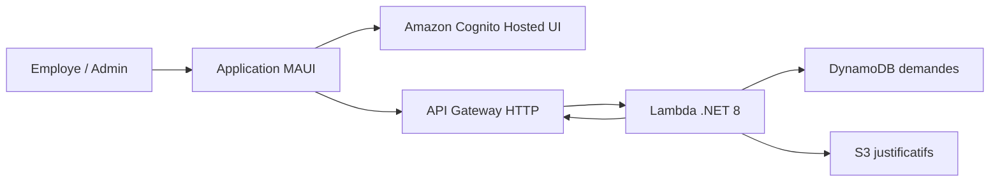

# NotesDeFrais

Application .NET MAUI de gestion de notes de frais, connectee a une stack AWS serverless. Le projet couvre deux profils :

- Employe : connexion, creation d'une demande de remboursement, ajout d'un justificatif image, suivi de ses demandes.
- Admin : connexion, consultation des demandes par statut, ouverture du justificatif, acceptation ou refus avec commentaire.

## Etat actuel

Le client MAUI est fonctionnel avec :

- Authentification Cognito Hosted UI en OAuth code flow avec PKCE.
- Stockage local des tokens, avec fallback pour les builds MacCatalyst locaux.
- Configuration chargee depuis l'environnement, sans ecran technique pour l'utilisateur final.
- Upload de justificatif vers S3 via URL presignee.
- Creation et listing des demandes via API Gateway + Lambda.
- Espace admin visible uniquement quand le token Cognito contient le groupe `ADMIN`.
- Sur MacCatalyst, un champ de chemin local permet de charger un justificatif si le picker natif MAUI se comporte mal.

Le backend AWS se trouve dans [legacy/aws](legacy/aws) et utilise SAM.

## Architecture rapide



Voir [stack.md](stack.md) pour le schema detaille et les flux.

## Prerequis

- .NET SDK avec workload MAUI.
- AWS CLI configure.
- AWS SAM CLI.
- Un compte AWS autorise a creer Cognito, API Gateway, Lambda, DynamoDB, S3 et les roles IAM SAM.

Verification locale utile :

```bash
dotnet --info
sam --version
aws sts get-caller-identity
```

## Deployer le backend

Depuis le dossier AWS :

```bash
cd legacy/aws

sam deploy \
  --parameter-overrides \
  AppOrigin="http://localhost:3000" \
  NativeCallbackUrl="notesdefrais://auth" \
  NativeLogoutUrl="notesdefrais://signout" \
  EnableCognitoHostedUiDomain="true" \
  CognitoDomainPrefix="notesdefrais-votre-prefixe"
```

Apres deploiement, recuperer les sorties :

```bash
aws cloudformation describe-stacks \
  --region eu-west-3 \
  --stack-name expense-api \
  --query "Stacks[0].Outputs"
```

Les valeurs importantes sont :

- `ExpenseApiUrl`
- `CognitoHostedUiDomain`
- `CognitoClientId`
- `CognitoUserPoolId`

## Configurer l'application

L'application lit la configuration depuis les variables d'environnement. Elles doivent etre definies avant le lancement de l'app :

- `EXPENSE_API_URL`
- `COGNITO_DOMAIN`
- `COGNITO_CLIENT_ID`
- `COGNITO_REDIRECT_URI`
- `COGNITO_LOGOUT_URI`

Le depot fournit un modele versionnable : `.env.example`. Le fichier local reel doit s'appeler `.env` et ne doit pas etre committe.

```bash
cp .env.example .env
```

Remplir ensuite `.env` avec les sorties CloudFormation :

| Variable | Valeur a utiliser |
| --- | --- |
| `EXPENSE_API_URL` | `ExpenseApiUrl` |
| `COGNITO_DOMAIN` | `CognitoHostedUiDomain` |
| `COGNITO_CLIENT_ID` | `CognitoClientId` |
| `COGNITO_REDIRECT_URI` | `notesdefrais://auth` |
| `COGNITO_LOGOUT_URI` | `notesdefrais://signout` |

Charger le fichier avant de lancer l'app depuis un terminal :

```bash
set -a
source .env
set +a
dotnet build NotesDeFrais.csproj -f net10.0-maccatalyst
```

Si l'app est lancee depuis Visual Studio, Rider ou VS Code, renseigner les memes variables dans la configuration de lancement de l'IDE. Ne pas commit de fichier de lancement contenant les vraies valeurs ; `.env`, `.env.*`, `appSettings.local.json` et `Properties/launchSettings.local.json` sont ignores par Git.

La page `Session` sert uniquement a connecter ou deconnecter l'utilisateur. Si une variable obligatoire manque, l'app affiche un message d'indisponibilite au lieu d'un formulaire de configuration.

## Creer les comptes

Les utilisateurs sont geres dans Cognito. Les roles viennent des groupes Cognito :

- `EMPLOYEE`
- `ADMIN`

Ajouter un utilisateur au groupe employe :

```bash
aws cognito-idp admin-add-user-to-group \
  --region eu-west-3 \
  --user-pool-id "USER_POOL_ID" \
  --username "user@example.com" \
  --group-name EMPLOYEE
```

Ajouter un utilisateur au groupe admin :

```bash
aws cognito-idp admin-add-user-to-group \
  --region eu-west-3 \
  --user-pool-id "USER_POOL_ID" \
  --username "admin@example.com" \
  --group-name ADMIN
```

Apres un changement de groupe, il faut se deconnecter puis se reconnecter dans l'app pour obtenir un nouveau token Cognito.

## Utilisation

Employe :

1. Se connecter avec Cognito.
2. Renseigner montant, categorie et description.
3. Choisir un justificatif image.
4. Sur MacCatalyst, si le picker ne charge pas le fichier, coller le chemin complet dans le champ de chemin local puis cliquer `Charger`.
5. Envoyer la demande.

Admin :

1. Se connecter avec un compte dans le groupe `ADMIN`.
2. Ouvrir la section `Validation admin`.
3. Filtrer par statut `PENDING`, `APPROVED` ou `REJECTED`.
4. Ouvrir le justificatif avec le bouton `Justificatif`.
5. Accepter ou refuser la demande.

## Commandes de verification

Compiler le client MAUI cote code partage :

```bash
dotnet build NotesDeFrais.csproj -f net10.0-android -t:CoreCompile
```

Compiler la Lambda :

```bash
dotnet build legacy/aws/lambdas/expense-api/ExpenseApi.csproj
```

Valider le template SAM :

```bash
sam validate --lint --template-file legacy/aws/template.yaml
```

## Depannage

`Acces refuse` cote admin :

- Verifier que l'utilisateur est dans le groupe `ADMIN`.
- Se deconnecter puis se reconnecter pour regenerer le token.
- Verifier que l'app pointe vers le bon User Pool et le bon client Cognito.

`Justificatif requis` alors qu'un fichier a ete choisi :

- Sur MacCatalyst, utiliser le champ de chemin local et cliquer `Charger`.
- Verifier que le fichier est en `.jpg`, `.jpeg`, `.png`, `.webp` ou `.gif`.

Erreur de domaine Cognito lors du changement de prefixe :

- Voir la section dediee dans [legacy/aws/README.md](legacy/aws/README.md).

## Structure

```text
.
|-- MainPage.xaml / MainPage.xaml.cs     Interface MAUI principale
|-- Models/                              Modeles de demandes et utilisateur
|-- Services/                            Auth Cognito, client API, config, JWT
|-- Platforms/                           Configuration native Android/iOS/Mac
|-- legacy/aws/template.yaml             Stack SAM
|-- legacy/aws/lambdas/expense-api/      Lambda .NET 8
|-- legacy/aws/README.md                 Documentation AWS detaillee
|-- stack.md                             Architecture et flux
```
