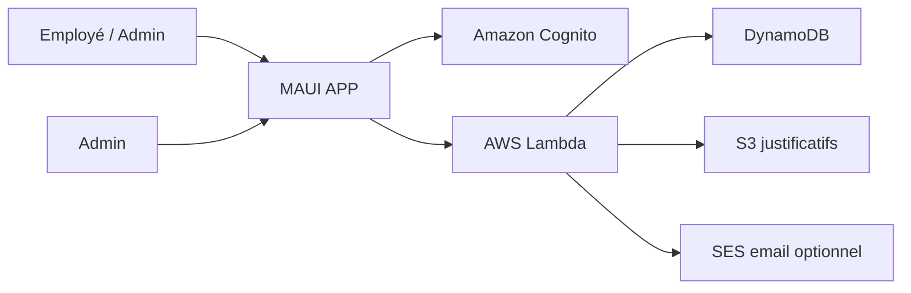

```mermaid
flowchart LR
  User["Employé / Admin"] --> .NET["MAUI APP"]
  .NET --> Cognito["Amazon Cognito"]
  .NET --> Lambda["AWS Lambda"]
  Lambda --> Dynamo["DynamoDB"]
  Lambda --> S3["S3 justificatifs"]
  Lambda --> SES["SES email optionnel"]
  Admin["Admin"] --> .NET

```
