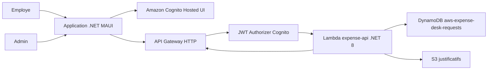
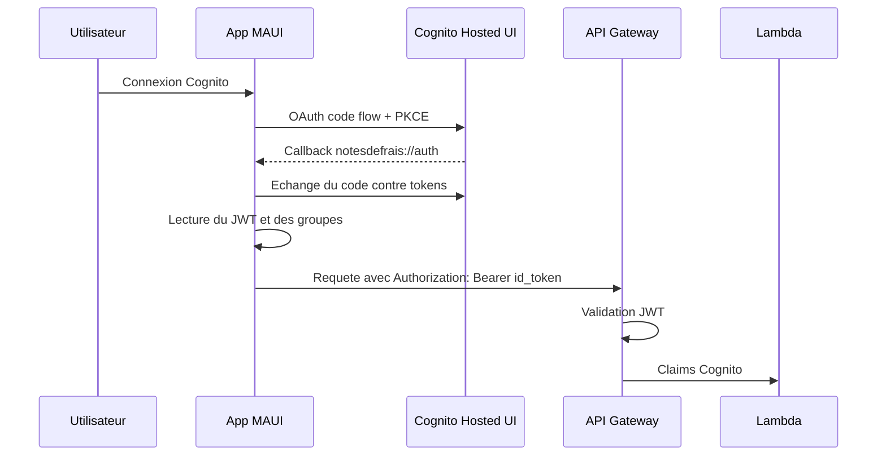
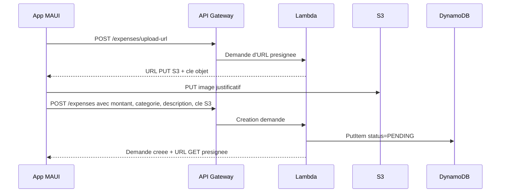
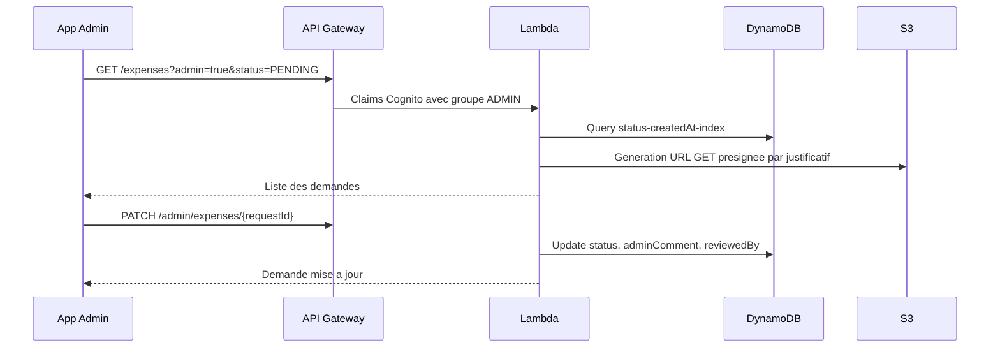

# Architecture

Ce document decrit le fonctionnement technique de l'application NotesDeFrais.

## Vue d'ensemble

## Flux d'authentification

Le role applicatif depend du claim `cognito:groups` :

- `EMPLOYEE` : peut creer et consulter ses demandes.
- `ADMIN` : peut consulter les demandes par statut et les accepter/refuser.

La Lambda accepte plusieurs formats de groupes (`ADMIN`, `ADMIN,EMPLOYEE`, ou `["ADMIN"]`) pour rester compatible avec le format transmis par API Gateway.

## Flux de creation d'une demande

## Flux admin

## Ressources AWS

La stack SAM cree :

- `ExpenseUserPool` : User Pool Cognito.
- `ExpenseUserPoolClient` : client OAuth public, sans secret.
- `ExpenseUserPoolDomain` : domaine Hosted UI optionnel.
- `EmployeeGroup` et `AdminGroup` : groupes de role.
- `ExpenseHttpApi` : API Gateway HTTP protegee par JWT authorizer Cognito.
- `ExpenseApiFunction` : Lambda .NET 8.
- `ExpenseTable` : table DynamoDB avec index par employe et par statut.
- `ReceiptsBucket` : bucket S3 prive pour les justificatifs.

## Endpoints API

Toutes les routes sont protegees par Cognito.

| Methode | Route | Role | Description |
| --- | --- | --- | --- |
| `POST` | `/expenses/upload-url` | Connecte | Genere une URL S3 presignee pour upload |
| `POST` | `/expenses` | Connecte | Cree une demande de remboursement |
| `GET` | `/expenses` | Connecte | Liste les demandes de l'utilisateur courant |
| `GET` | `/expenses?admin=true&status=PENDING` | `ADMIN` | Liste les demandes par statut |
| `PATCH` | `/admin/expenses/{requestId}` | `ADMIN` | Accepte ou refuse une demande |

## Donnees DynamoDB

Cle primaire :

- `requestId`

Index :

- `employeeId-createdAt-index` pour le suivi employe.
- `status-createdAt-index` pour le listing admin.

Champs principaux :

- `requestId`
- `employeeId`
- `employeeEmail`
- `employeeName`
- `amount`
- `currency`
- `category`
- `description`
- `receiptS3Key`
- `receiptFileName`
- `receiptContentType`
- `status`
- `adminComment`
- `reviewedBy`
- `createdAt`
- `updatedAt`

## Particularites MacCatalyst

Le picker de fichier MAUI peut etre instable selon la version macOS / MAUI. L'application propose donc deux chemins :

- bouton `Choisir un justificatif` ;
- champ de chemin local + bouton `Charger`.

Le submit utilise les bytes charges en memoire, pas directement le `FileResult`, afin de fiabiliser l'upload S3.
